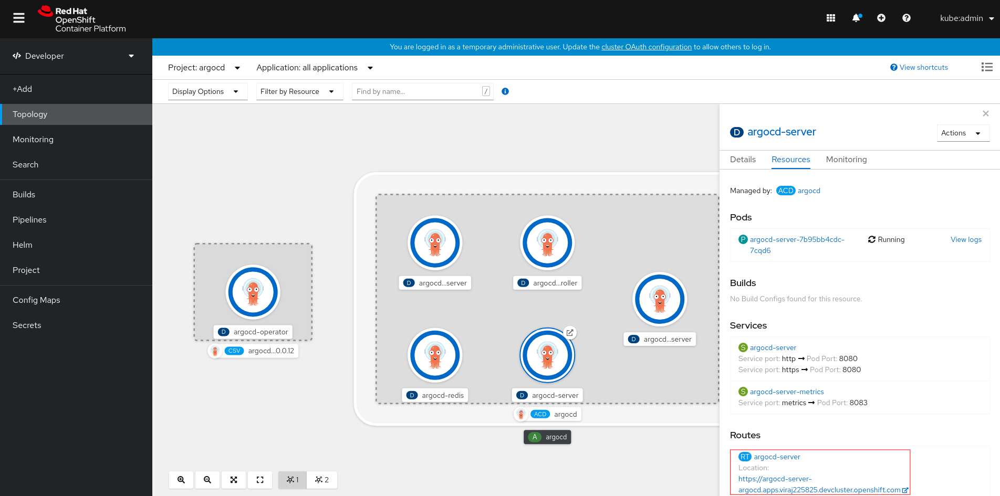

### ArgoCD Installation - with operator( Recommended )

Create argocd namespace to install the operator

```shell
oc create namespace argocd
```

Click on the ArgoCD operator as shown below in the OperatorHub on your OpenShift console and install the operator in the argocd namespace.


Create an instance of ArgoCD

```yaml
apiVersion: argoproj.io/v1alpha1
kind: ArgoCD
metadata:
  name: argocd
  namespace: argocd
spec:
  server:
    route:
      enabled: true
  dex:
    image: quay.io/redhat-cop/dex
    openShiftOAuth: true
    version: v2.22.0-openshift
```

Note: Due to an active [issue](https://github.com/argoproj-labs/argocd-operator/issues/107) the operator may not create enough privileges to manage multiple namespaces. In order to solve this apply
```shell
 oc adm policy add-cluster-role-to-user cluster-admin system:serviceaccount:argocd:argocd-application-controller
```

When the pods are up, open the ArgoCD web UI by clicking on the created route  



#### Login using OpenShift OAuth

ArgoCD provides the ability to integrate with an external user management system through Single Sign On (SSO) capabilities. Included with the deployment of ArgoCD is a Dex, a bundled OpenID Connect (OIDC) and OAuth Server with support for pluggable connectors to connect to user management systems. Dex can be configured to make use of OpenShift's authentication capabilities. By using Openshift OAuth users can fully leverage OpenShift's authentication capabilities in ArgoCD. Read more about [OpenShift Authentication Integration With ArgoCD](https://www.openshift.com/blog/openshift-authentication-integration-with-argocd)


#### Login using ArgoCD credentials

Get your login credentials from the cluster

```shell
kubectl get secret argocd-cluster -n argocd -ojsonpath='{.data.admin\.password}' | base64 --decode 
```

You can now login with username as `admin` and password fetched in the previous step
