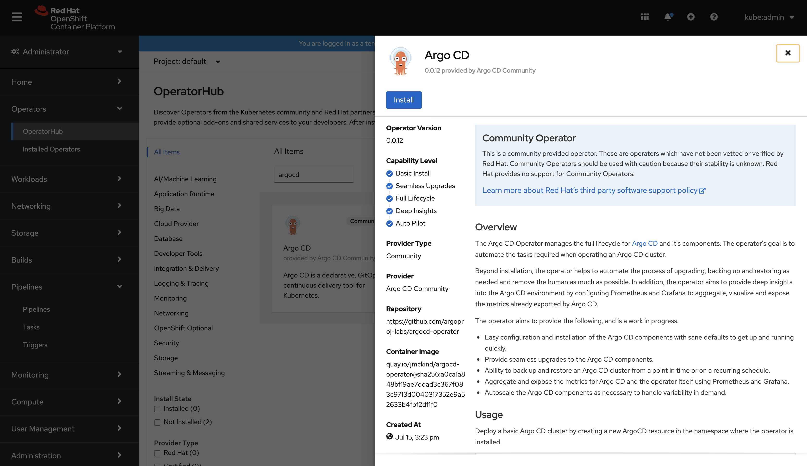

### ArgoCD Installation - with operator( Recommended )

Create argocd namespace to install the operator

```shell
oc create namespace argocd
```

Click on the ArgoCD operator as shown below in the OperatorHub on your OpenShift console and install the operator in the argocd namespace.



Create an instance of ArgoCD

```yaml
apiVersion: argoproj.io/v1alpha1
kind: ArgoCD
metadata:
  name: argocd
  namespace: argocd
spec:
  server:
    route:
      enabled: true
```

Note: Due to an active [issue](https://github.com/argoproj-labs/argocd-operator/issues/107) the operator may not create enough privileges to manage multiple namespaces. In order to solve this apply
```shell
 oc adm policy add-cluster-role-to-user cluster-admin system:serviceaccount:argocd:argocd-application-controller
```

When the pods are up, open the ArgoCD web UI by clicking on the created route  


Get your login credentials from the cluster

```shell
kubectl get secret argocd-cluster -n argocd -ojsonpath='{.data.admin\.password}' | base64 --decode 
```

You can now login with username as `admin` and password fetched in the previous step

